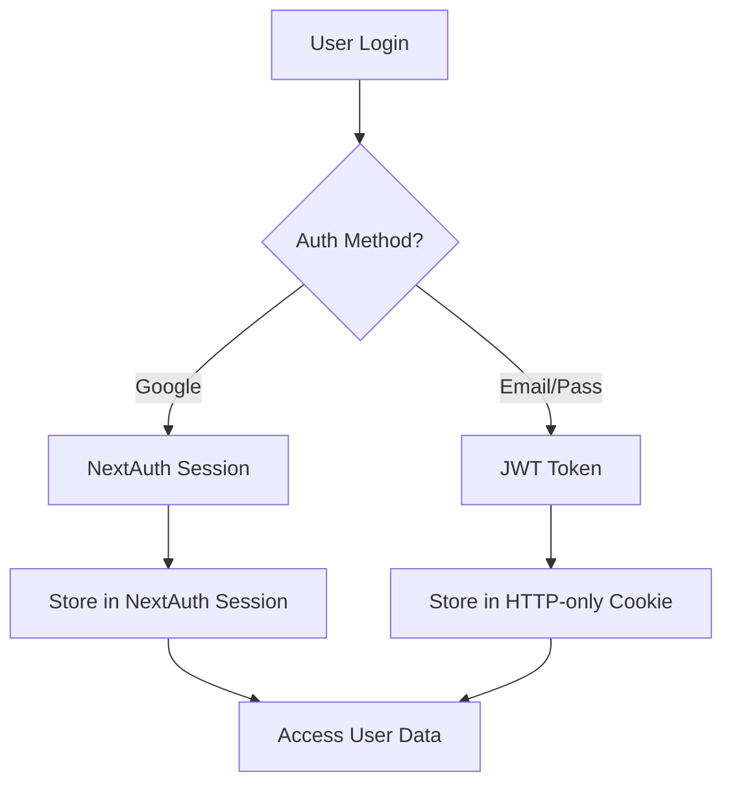

# E-Commerce Platform - Complete Documentation

## Project Overview

A full-stack e-commerce platform built with Next.js 15 that supports dual user types: **Personal Users** (shoppers) and **Business Users** (sellers). The platform enables seamless shopping experiences with features like cart management, product listing, authentication, and payment processing.

---

## Technology Stack

### Frontend
- **Framework**: Next.js 15.4.1 with App Router
- **React**: 19.1.0
- **Styling**: Tailwind CSS 4.x
- **UI Components**: Radix UI Themes
- **Icons**: Lucide React, React Icons
- **State Management**: React Context API

### Backend
- **Runtime**: Node.js
- **API**: Next.js API Routes (Server Actions)
- **Database**: MongoDB (Cloud-based)
- **ORM**: Prisma 6.12.0
- **Authentication**: NextAuth.js v5 (beta) + Custom JWT
- **JWT Handling**: jsonwebtoken 9.0.2

### DevOps & Tools
- **Package Manager**: npm
- **TypeScript**: 5.8.3
- **Build Tool**: Next.js built-in (Turbopack support)

---

## Core Features

### 1. User Management
- **Dual Authentication System**:
  - Google OAuth (via NextAuth.js)
  - Email/Password (Custom JWT-based)
- **User Roles**:
  - Personal Users: Browse and purchase products
  - Business Users: List products, manage company, view sales
- **Session Management**: HTTP-only cookies with JWT tokens

### 2. Product Management
- Dynamic product catalog with pagination (15 items/page)
- 10+ category-based filtering with custom icons
- Price range filtering
- Full-text search functionality
- Similar product recommendations based on category
- Business users can CRUD their products

### 3. Shopping Cart System
- **Guest Cart**: Stored in localStorage
- **Authenticated Cart**: Persisted in database
- **Automatic Sync**: Guest cart merges into DB upon login
- Real-time quantity updates
- Cart item count badge in header

### 4. Save for Later
- Move items from cart to save-for-later list
- Move saved items back to cart
- Persists across sessions for logged-in users
- localStorage for guests

### 5. Business Features
- Company registration with verification
- Product creation and editing
- Sales dashboard (`/all-sales-product`)
- Products linked to company ownership

### 6. Checkout Flow
```
Cart → Address & Contact → Payment Method → Order Confirmation
```
- Address validation with required fields
- Multiple payment options (Razorpay, UPI, COD, Net Banking, EMI)
- Promo code support (SAVE10, FIRST50)
- Order summary with tax calculation (18% GST)

### 7. Search & Discovery
- Global search bar with autocomplete
- Category-based filtering (horizontal scroll navbar)
- Price range filters
- Product detail pages with similar products

---

## Architecture Patterns

### 1. File-Based Routing
```
src/app/
├── (group)/          # Grouped routes with shared layout
│   ├── Header/       # Shared navigation
│   ├── cart/
│   ├── product/[id]/
│   ├── search/
│   └── context/      # React Context providers
├── api/              # Backend API routes
│   ├── auth/
│   ├── cart/
│   ├── products/
│   └── ...
├── login/
└── signup/
```

### 2. State Management Strategy
- **Global State**: React Context API
  - `CartContext`: Manages shopping cart and user data
  - `SaveContext`: Manages save-for-later items
- **Local State**: React useState for component-level state
- **Server State**: Prisma ORM for database queries

### 3. Authentication Flow


### 4. Cart Synchronization
```
Guest User → Add to Cart → localStorage
     ↓ (User logs in)
Merge localStorage cart → Database (POST /api/cart/merge)
     ↓
Clear localStorage → Fetch from DB
```

---

## Database Design Principles

### Key Entities
1. **User**: Stores user credentials, preferences, and authentication data
2. **Product**: Product catalog with pricing, descriptions, images
3. **Company**: Business entity linked to product owners
4. **Cart Models**:
   - `cart`: Temporary guest cart storage
   - `cartdata`: Persistent authenticated user cart
5. **Save**: Save-for-later items

### Relationships
- User → Company (One-to-Many)
- Company → Products (One-to-Many)
- User → Cart Items (One-to-Many)
- User → Saved Items (One-to-Many)

### Data Flow
- Products created by business users link to their company via `companyId`
- Cart items reference both user and product
- All IDs use MongoDB ObjectId format

---

## API Architecture

### RESTful Endpoints

#### Authentication
- `POST /api/signup` - Register new user
- `POST /api/login` - Authenticate user
- `POST /api/logout` - Clear session
- `GET/POST /api/auth/[...nextauth]` - NextAuth handlers

#### Products
- `GET /api/products` - List all products
- `GET /api/products/[id]` - Get single product
- `POST /api/products` - Create product (Business only)
- `POST /api/edit-product/[id]` - Update product
- `GET /api/search` - Search with filters
- `GET /api/selectproducts` - Filter by category
- `GET /api/similarproducts` - Get related products

#### Cart
- `GET /api/cart` - Get user's cart
- `POST /api/cart` - Add to cart
- `PUT /api/cart/update` - Update quantity
- `DELETE /api/cart/delete` - Remove item
- `POST /api/cart/merge` - Merge guest cart on login
- `POST /api/cart/savelater` - Move to save-for-later

#### Company
- `POST /api/addcompany` - Register company
- `GET /api/allsalesproduct` - List company products

---

## Security Implementation

### 1. Authentication Security
- HTTP-only cookies for JWT storage
- Secure session management with NextAuth
- Environment-based secret keys

### 2. Authorization
- Role-based access control (Personal vs Business)
- Company ownership verification for product edits
- User-specific cart and saved items

### 3. Input Validation
- Server-side validation on all API routes
- Type checking with TypeScript
- Prisma ORM prevents SQL injection

### 4. Environment Variables
```env
DATABASE_URL          # MongoDB connection string
JWT_SECRET           # JWT signing key
AUTH_SECRET          # NextAuth secret
AUTH_GOOGLE_ID       # Google OAuth Client ID
AUTH_GOOGLE_SECRET   # Google OAuth Secret
NEXT_PUBLIC_BASE_URL # App base URL
```

---

## Performance Optimizations

1. **Server Components**: Default in Next.js 15 App Router
2. **Image Optimization**: Next.js `<Image>` component with remote patterns
3. **Code Splitting**: Automatic route-based splitting
4. **Caching**: Browser caching for static assets
5. **Pagination**: Reduces initial data load to 15 items per page
6. **Client-Side Routing**: Next.js Link for instant navigation

---

## User Experience Features

### 1. Responsive Design
- Mobile-first approach
- Tailwind CSS breakpoints (sm, md, lg, xl)
- Horizontal scrolling category navbar on mobile

### 2. Loading States
- Skeleton screens during data fetch
- Loading spinners for async operations
- Optimistic UI updates

### 3. Interactive Elements
- Hover effects with Lucide icons
- Animated transitions (fade-in, scale)
- Toast notifications (via alerts)
- Advertisement carousel (auto-rotate every 3s)

### 4. Accessibility
- Semantic HTML structure
- ARIA labels where appropriate
- Keyboard navigation support

---

## Deployment Considerations

### Recommended Platform: Vercel
1. Push to GitHub repository
2. Import project in Vercel
3. Add environment variables in settings
4. Automatic deployments on push

### Environment Setup
- Node.js 18.18+ required
- MongoDB Atlas account needed
- Google OAuth credentials from Google Cloud Console

### Build Process
```bash
npm run generate  # Generate Prisma client
npm run build     # Build Next.js app
npm start         # Production server
```

---

## Future Enhancements Roadmap

- [ ] Order history and tracking
- [ ] Product reviews and ratings
- [ ] Wishlist functionality
- [ ] Advanced analytics dashboard for businesses
- [ ] Email notifications
- [ ] Multi-language support
- [ ] Dark mode
- [ ] PWA support
- [ ] Real-time inventory management
- [ ] Actual Razorpay payment integration

---

## Project Structure Summary

```
/
├── src/
│   ├── app/              # Next.js 15 App Router
│   ├── components/       # Reusable UI components
│   ├── services/         # Backend utilities
│   └── constants/        # Static data
├── prisma/              # Database schema
├── public/              # Static assets
├── auth.ts              # NextAuth config
└── middleware.ts        # NextAuth middleware
```

---

## Key Differentiators

1. **Dual User System**: Unique separation of personal and business users
2. **Smart Cart Sync**: Seamless guest-to-authenticated cart migration
3. **Save for Later**: Enhanced shopping flexibility
4. **Company Management**: Business users manage their own product catalog
5. **Category Navigation**: Visually appealing horizontal scroll with gradients

---

## Development Guidelines

### Code Style
- TypeScript with strict mode
- Functional components with hooks
- Server components by default (Next.js 15)
- Client components only when needed (use "use client")

### File Naming
- kebab-case for files: `add-company-btn.tsx`
- PascalCase for components: `AddCompanyBtn`
- Route folders: lowercase with hyphens
